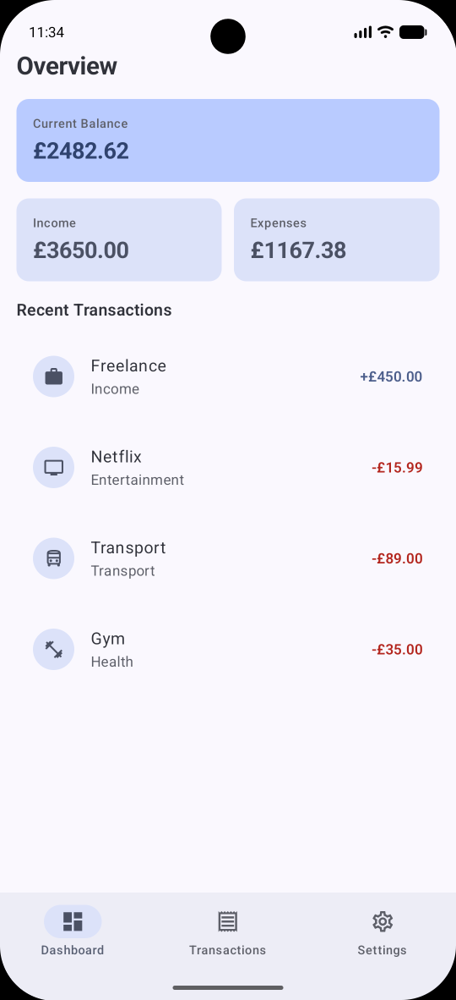
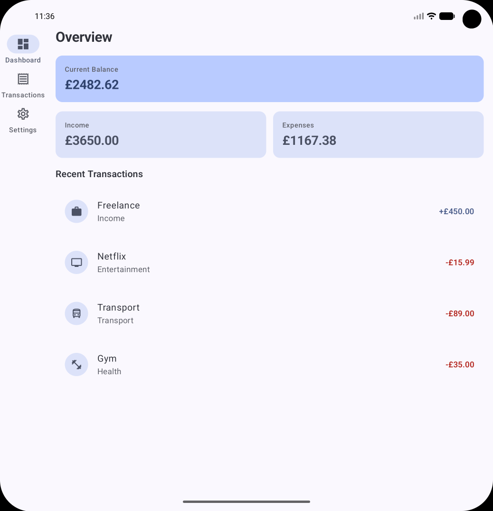
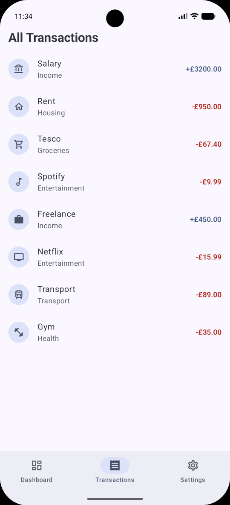
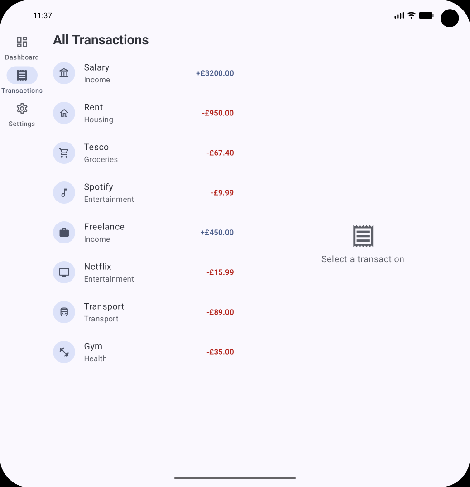
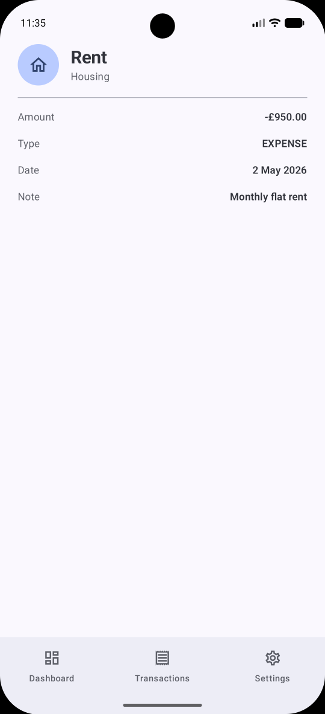
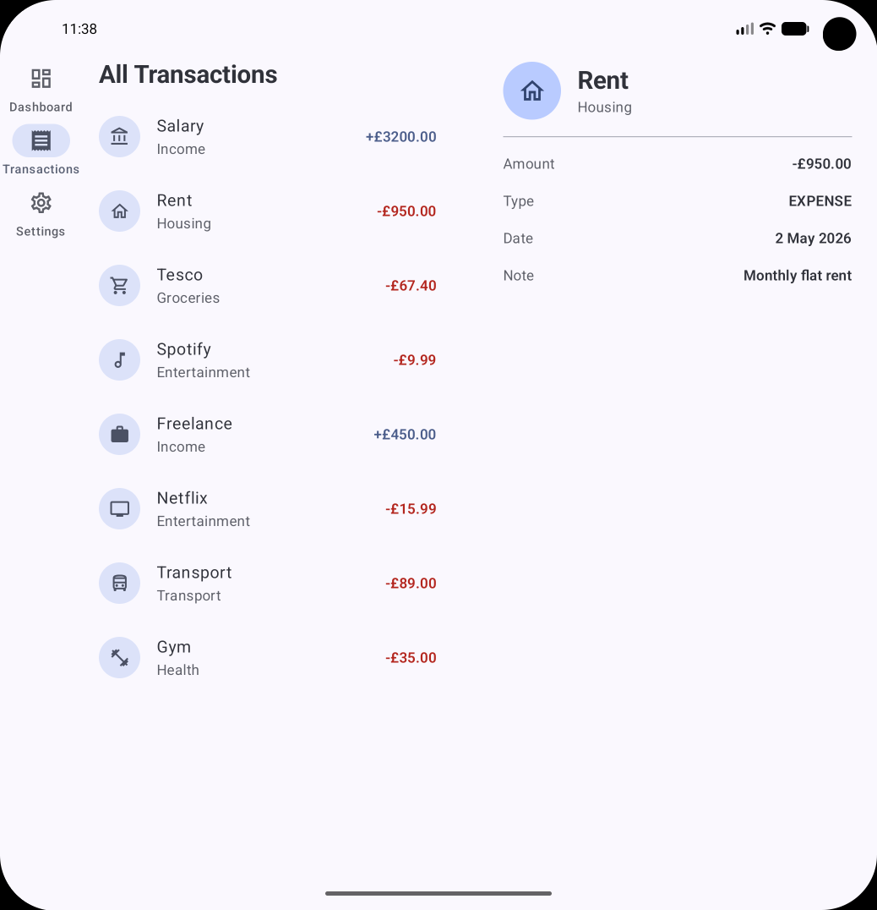

<div align="center">

# SpendSense

<p align="center">

</p>

[](https://kotlinlang.org)
[](https://developer.android.com)
[](https://developer.android.com/jetpack/compose)
[](https://developer.android.com/jetpack/compose/navigation)
[](https://developer.android.com/develop/ui/compose/layouts/adaptive)


## Adaptive Finance Dashboard

### A adaptive UI project demonstrating responsive layout across phones, foldables, and tablets using WindowSizeClass, NavigationSuiteScaffold, and ListDetailPaneScaffold from the Material 3 adaptive library.

</div>

---

## 📱 What This App Does

SpendSense is a personal finance overview dashboard, a static UI showing balance summaries, income, expenses, and a transaction list with detail view. A user can browse their financial overview on Dashboard, explore all transactions on the Transactions tab, and tap any transaction to see its detail.

**All data is static.** There is no network layer, no database, and no remote API. The complexity budget of this project is spent entirely on adaptive layout architecture, how the same screens reshape themselves correctly across every form factor Android supports.
---

## 📸 Screenshots

<div align="center">

| Phone | Foldable |
|:-----:|:------:|
|  |  |
|  |  |
|  |  |


</div>

---

## 🛠️ Tech Stack

| Category | Technology | Why This Choice |
|----------|-----------|-----------------|
| **Language** | Kotlin 2.3.21 | Coroutines, Flow, serialization plugin, null safety |
| **UI** | Jetpack Compose BOM 2026.05.01 | Declarative UI, adaptive layout composables |
| **Navigation** | Navigation Compose 2.9.8 | Typed routes, back stack management |
| **Adaptive Navigation** | material3-adaptive-navigation-suite 1.4.0 | `NavigationSuiteScaffold`  renders correct nav component per breakpoint |
| **Adaptive Layout** | adaptive + adaptive-layout + adaptive-navigation 1.2.0 | `ListDetailPaneScaffold`  two-pane layout on Expanded screens |
| **Window Size** | material3-window-size-class-android 1.4.0 | `WindowSizeClass`  reads current breakpoint |
| **Serialization** | Kotlinx Serialization JSON 1.11.0 | Compile-time safe typed navigation routes |
| **State** | ViewModel + StateFlow | Lifecycle-aware UI state, survives rotation |
| **Build** | Gradle KTS + Version Catalog | Centralised, type-safe dependency management |

---

## 🏗️ Adaptive Architecture

### The Core Principle

Adaptive UI done correctly means **branching on screen size happens once** at the highest appropriate level and every component below that point is already receiving the right layout for its context. If you find yourself writing `if (Compact) ... else ...` in three different files, the architecture is wrong.

SpendSense achieves this through two Material 3 adaptive scaffolds that each own their branching internally:

```
MainActivity
    └── calculateWindowSizeClass(this)
            │
            ▼
    SpendSenseApp(windowSizeClass)
            │
            ▼
    NavigationSuiteScaffold          ← reads WindowSizeClass internally
    │   renders: NavigationBar       (Compact)
    │            NavigationRail      (Medium)
    │            NavigationDrawer    (Expanded)
            │
            ▼
    AppNavHost(isExpanded)
            │
            ├── Dashboard Screen
            ├── Settings Screen
            └── Transactions
                    │
                    ├── isExpanded = false → TransactionsScreen (single pane)
                    │                        + TransactionDetail (separate screen)
                    └── isExpanded = true  → ListDetailPaneScaffold
                                             ├── List Pane
                                             └── Detail Pane
```

### Breakpoint Reference

| Breakpoint | Width Threshold | Device | Navigation | Transaction Layout |
|-----------|----------------|--------|------------|-------------------|
| Compact | < 600dp | Phone portrait | NavigationBar | Single screen |
| Medium | 600dp – 840dp | Foldable, phone landscape | NavigationRail | Single screen |
| Expanded | > 840dp | Tablet landscape | NavigationDrawer | List + Detail side by side |

---

## 🔑 Key Implementation Decisions

### 1. WindowSizeClass Calculated Once at Activity Level

```kotlin
class MainActivity : ComponentActivity() {
    override fun onCreate(savedInstanceState: Bundle?) {
        super.onCreate(savedInstanceState)
        enableEdgeToEdge()
        setContent {
            val windowSizeClass = calculateWindowSizeClass(this)
            SpendSenseTheme {
                SpendSenseApp(windowSizeClass = windowSizeClass)
            }
        }
    }
}
```

`calculateWindowSizeClass` is called once at the Activity level and passed down. It is not called inside individual composables. This matters because `calculateWindowSizeClass` requires a `ComponentActivity` reference it is an Activity-level concern, not a composable concern. Passing the result as a parameter keeps composables testable and independent of the Activity.

`WindowSizeClass` updates automatically on rotation and fold/unfold events. The entire composable tree below it recomposes when the breakpoint changes  the user sees the correct layout immediately with no manual handling.

### 2. NavigationSuiteScaffold Replaces Three Components with One

The naive adaptive navigation implementation looks like this:

```kotlin
// ❌ What most developers write
when (windowSizeClass.widthSizeClass) {
    Compact   -> NavigationBar(items)
    Medium    -> NavigationRail(items)
    Expanded  -> NavigationDrawer(items)
}
```

SpendSense uses this instead:

```kotlin
// ✅ What NavigationSuiteScaffold does for you
NavigationSuiteScaffold(
    navigationSuiteItems = {
        topLevelRoutes.forEach { route ->
            item(
                selected = isSelected(route),
                onClick = { navController.navigate(route.route) { ... } },
                icon = { Icon(route.icon, ...) },
                label = { Text(route.label) }
            )
        }
    }
) {
    // Content slot
    AppNavHost(...)
}
```

`NavigationSuiteScaffold` reads the current window size class internally and renders `NavigationBar`, `NavigationRail`, or `NavigationDrawer` accordingly. The items are defined once. The scaffold chooses the container. This means the navigation item definitions never change regardless of breakpoint  only their visual presentation does.

### 3. ListDetailPaneScaffold Manages Two-Pane vs Single-Pane

The Transactions feature requires fundamentally different behaviour at different breakpoints:

- On **Compact/Medium**: tapping a transaction navigates to a new screen
- On **Expanded**: tapping a transaction updates a detail pane alongside the list

`ListDetailPaneScaffold` handles this transition:

```kotlin
@Composable
fun TransactionsListDetailLayout(
    selectedTransactionId: Int?,
    onTransactionSelected: (Int) -> Unit
) {
    val navigator = rememberListDetailPaneScaffoldNavigator<Nothing>()

    ListDetailPaneScaffold(
        directive = navigator.scaffoldDirective,
        value = navigator.scaffoldValue,
        listPane = {
            AnimatedPane {
                TransactionsScreen(
                    onTransactionClick = { id ->
                        onTransactionSelected(id)
                        navigator.navigateTo(ListDetailPaneScaffoldRole.Detail)
                    },
                    selectedTransactionId = selectedTransactionId
                )
            }
        },
        detailPane = {
            AnimatedPane {
                TransactionDetailScreen(transactionId = selectedTransactionId)
            }
        }
    )
}
```

`navigator.scaffoldDirective` tells the scaffold whether it has enough space to show both panes. On Expanded this is true both panes render side by side. On Compact/Medium this is false only one pane is visible at a time and `navigator.navigateTo(Detail)` switches which one is shown.

`AnimatedPane` wraps each pane to provide the crossfade transition when switching between them on narrower screens.

### 4. Selected Transaction State Lives Above the Nav Graph

On Expanded screens, tapping a transaction in the list should highlight it and show its detail without navigation. This requires `selectedTransactionId` state to live above `AppNavHost`, not inside the Transactions screen:

```kotlin
// SpendSenseApp.kt
var selectedTransactionId by remember { mutableStateOf<Int?>(null) }

NavigationSuiteScaffold(...) {
    AppNavHost(
        isExpanded = isExpanded,
        selectedTransactionId = selectedTransactionId,
        onTransactionSelected = { id -> selectedTransactionId = id }
    )
}
```

If this state lived inside the Transactions composable, it would be lost whenever the user navigated to Dashboard and back. Hoisting it to `SpendSenseApp` means it survives tab switches and is available to both `TransactionsScreen` (for highlighting the selected row) and `TransactionDetailScreen` (for rendering the correct detail).

### 5. Adaptive Routing in AppNavHost

The same tap on a transaction produces different behaviour depending on `isExpanded`:

```kotlin
composable<Transactions> {
    if (isExpanded) {
        TransactionsListDetailLayout(
            selectedTransactionId = selectedTransactionId,
            onTransactionSelected = onTransactionSelected
        )
    } else {
        TransactionsScreen(
            onTransactionClick = { id ->
                navController.navigate(TransactionDetail(id))
            }
        )
    }
}
```

This is the **one** place in the codebase where `isExpanded` drives a branching decision at the routing level. Everywhere else, the adaptive scaffolds make the decision internally. The branching is localised, visible, and intentional rather than scattered.

### 6. selectedTransactionId Drives List Highlighting

On Expanded screens, the list highlights whichever transaction is currently shown in the detail pane. `TransactionsScreen` receives `selectedTransactionId` and applies a background highlight to that row:

```kotlin
TransactionItem(
    transaction = transaction,
    onClick = { onTransactionClick(transaction.id) },
    modifier = if (transaction.id == selectedTransactionId)
        Modifier.background(MaterialTheme.colorScheme.surfaceVariant)
    else
        Modifier
)
```

This creates the visual continuity between list and detail that users expect from a two-pane layout the list always shows which item the detail pane is displaying.

---

## 🗺️ Navigation Routes

```kotlin
@Serializable object Dashboard
@Serializable object Transactions
@Serializable object Settings
@Serializable data class TransactionDetail(val transactionId: Int)
```

`TransactionDetail` is a `data class` because it carries an argument  the transaction id. The full `Transaction` object is never passed through navigation. Instead, the id is passed and the detail screen looks up the transaction from `SampleData` at the destination. Navigation arguments should be primitive identifiers, not full objects.

---

## 📂 Project Structure

```
com.uansari.spendsense/
│
├── data/
│   └── SampleData.kt               ← hardcoded Transaction list, computed totals
│
├── model/
│   └── Transaction.kt              ← data class + TransactionType enum
│
├── navigation/
│   ├── Routes.kt                   ← @Serializable route definitions
│   └── AppNavHost.kt               ← NavHost + adaptive routing logic
│
├── ui/
│   ├── SpendSenseApp.kt            ← NavigationSuiteScaffold, top-level state
│   │
│   ├── dashboard/
│   │   └── DashboardScreen.kt
│   │
│   ├── transactions/
│   │   ├── TransactionsScreen.kt
│   │   ├── TransactionDetailScreen.kt
│   │   └── TransactionsListDetailLayout.kt  ← ListDetailPaneScaffold
│   │
│   ├── settings/
│   │   └── SettingsScreen.kt
│   │
│   └── components/
│       ├── TransactionItem.kt       ← shared list row, supports selection highlight
│       └── SummaryCard.kt          ← shared card for balance/income/expense
│
└── theme/
    └── Theme.kt
```

---

## 🧪 Breakpoint Verification Checklist

| Test | Compact | Medium | Expanded |
|------|---------|--------|----------|
| Correct navigation component visible | NavigationBar | NavigationRail | NavigationDrawer |
| Dashboard cards layout | Stacked | Stacked |  |
| Tapping a transaction | Navigates to detail screen | Navigates to detail screen | Updates detail pane |
| Detail pane empty state before selection | N/A | N/A | "Select a transaction" |
| Selected row highlighted in list | N/A | N/A | ✓ |
| Back press from detail screen | Returns to list | Returns to list | N/A |
| Selected transaction preserved on rotation | ✓ | ✓ | ✓ |
| Tab switch preserves selected transaction | N/A | N/A | ✓ |

---

## 🎓 What I Learned

<details>
<summary><b>Adaptive UI Architecture</b></summary>

**The branching should happen once, at the right level**  My first instinct was to read `WindowSizeClass` in each composable that needed it and write `if/else` locally. The problem is that this spreads breakpoint logic across the entire codebase. A change to how Compact is handled requires touching multiple files. The correct approach is to use scaffolds that encapsulate the breakpoint logic internally  `NavigationSuiteScaffold` for navigation, `ListDetailPaneScaffold` for content  and expose only a single, explicit `isExpanded` flag for the one routing decision that genuinely needs it.

**`NavigationSuiteScaffold` is not just a convenience wrapper**  It handles more than just switching between `NavigationBar` and `NavigationRail`. It manages the layout implications of each component  a navigation rail shifts the content area to the right, a drawer overlays or pushes content depending on display mode. Getting all of this right manually is a significant amount of work. The scaffold handles it correctly by default.

**Adaptive layout is a UX contract, not a technical trick**  On an Expanded screen, a user expects to see list and detail simultaneously. Navigating to a new screen and losing the list breaks their mental model. `ListDetailPaneScaffold` exists to honour that contract by making the two-pane layout the natural default when space allows.

</details>

<details>
<summary><b>State Hoisting for Adaptive Behaviour</b></summary>

**State that spans breakpoints must be hoisted above the nav graph**  `selectedTransactionId` needs to survive tab switches and drive both the list highlight and the detail pane. If it lived inside the Transactions composable, it would be destroyed on navigation. Hoisting it to `SpendSenseApp` means it has the same lifetime as the navigation graph  created once, persists until the user leaves the app.

**The question to ask is: which component is the lowest common ancestor that all consumers of this state share?** Both `TransactionsScreen` (consumer for list highlight) and `TransactionDetailScreen` (consumer for detail rendering) are children of `AppNavHost`, which is a child of `SpendSenseApp`. The lowest common ancestor is `SpendSenseApp`  so that's where the state lives.

**ViewModel is the right home for this in production**  A `remember { mutableStateOf(...) }` in a composable is destroyed on configuration change unless the composable survives. Putting `selectedTransactionId` in a ViewModel would make it survive rotation automatically. For a static portfolio project, `rememberSaveable` or a ViewModel at the `SpendSenseApp` level would be the production-correct choice.

</details>

<details>
<summary><b>ListDetailPaneScaffold Mechanics</b></summary>

**`scaffoldDirective` is the pane budget**  It tells the scaffold how many panes it has space to show simultaneously. On Expanded this is two. On Compact this is one. The scaffold uses this directive to decide whether to render both panes side by side or manage them as a single visible pane with navigation between them.

**`navigator.navigateTo(Detail)` is not the same as NavController navigation**  It doesn't add a destination to the NavController's back stack. It tells the `ListDetailPaneScaffold` which pane should be visible. On Expanded, where both panes are already visible, this call is effectively a no-op  the detail pane is already showing. On Compact, it brings the detail pane into view. The same call produces the correct behaviour at both breakpoints.

**`AnimatedPane` is worth including**  Without it, pane transitions on Compact/Medium are abrupt cuts. With it, the pane change is a smooth crossfade. It costs one wrapper composable and produces a significantly more polished result.

</details>

<details>
<summary><b>Navigation and Adaptive Behaviour Together</b></summary>

**Typed routes and adaptive routing are orthogonal concerns**  `@Serializable` route definitions handle argument safety. The `isExpanded` flag in `AppNavHost` handles adaptive behaviour. Neither knows about the other. This separation means you can change the adaptive logic without touching the route definitions, and refactor routes without affecting adaptive decisions.

**The `TransactionDetail` route still exists on Expanded screens**  even though it's never navigated to on Expanded, the route definition remains in the graph. This is intentional  removing it would mean deep links and rotation edge cases could break. Routes are a contract; the adaptive logic is an implementation detail above them.

</details>

---

## 🚧 Scope: Learning Project vs Production

### What's Implemented

| Feature | Status | Notes |
|---------|--------|-------|
| NavigationSuiteScaffold | ✅ Complete | Auto-renders Bar / Rail / Drawer per breakpoint |
| ListDetailPaneScaffold | ✅ Complete | Two-pane on Expanded, single-pane on Compact/Medium |
| WindowSizeClass integration | ✅ Complete | Calculated at Activity level, propagated down |
| Adaptive routing in NavHost | ✅ Complete | isExpanded drives single vs two-pane routing |
| Selected transaction state | ✅ Complete | Hoisted to SpendSenseApp, survives tab switches |
| List row highlight on selection | ✅ Complete | Visual continuity between list and detail pane |
| Typed navigation routes | ✅ Complete | `@Serializable` objects and data classes |
| Static sample data | ✅ Complete | 8 transactions across 5 categories |

### Production Enhancements

In a production finance app, the following would additionally be required:

| Enhancement | Why | Complexity |
|-------------|-----|-----------|
| **ViewModel for selected state** | Survive rotation and process death correctly | Low |
| **Room database** | Real transaction persistence | Medium |
| **Paging 3** | Efficient loading of large transaction history | Medium |
| **Charts and analytics** | Spending by category, monthly trends | Medium (Vico / MPAndroidChart) |
| **Search and filtering** | Find transactions by amount, category, date range | Medium |
| **Shared element transitions** | Transaction card expanding into detail view | Medium |
| **Navigation 3 migration** | `NavDisplay` + `NavBackStack` model | Medium |
| **Accessibility** | TalkBack focus management between panes | Medium |

**Why these aren't included:** The scope of this project is adaptive layout architecture. Adding data persistence, real networking, or complex filtering would dilute focus without contributing to the adaptive UI concepts being studied. Scope discipline is part of the design.

---

## 🗺️ Roadmap

- [x] Phase 1: Data model and static sample transactions
- [x] Phase 2: Static screen composables with Compose Previews
- [x] Phase 3: WindowSizeClass wired in MainActivity
- [x] Phase 4: NavigationSuiteScaffold  adaptive navigation
- [x] Phase 5: AppNavHost with isExpanded adaptive routing
- [x] Phase 6: ListDetailPaneScaffold  two-pane transactions layout
- [x] Phase 7: Selected transaction state hoisted and wired
- [x] Phase 8: README with adaptive architecture documentation
- [ ] Phase 9: ViewModel for selectedTransactionId (production-correct state)
- [ ] Phase 10: Shared element transitions (card → detail)
- [ ] Phase 11: Navigation 3 migration branch

---

## 👤 Author

**Usman Ali Ansari**

- 💼 LinkedIn: [usman1ansari](https://www.linkedin.com/in/usman1ansari)

---

<div align="center">

**Built with ❤️ as a deliberate study of Material 3 Adaptive UI**

</div>
